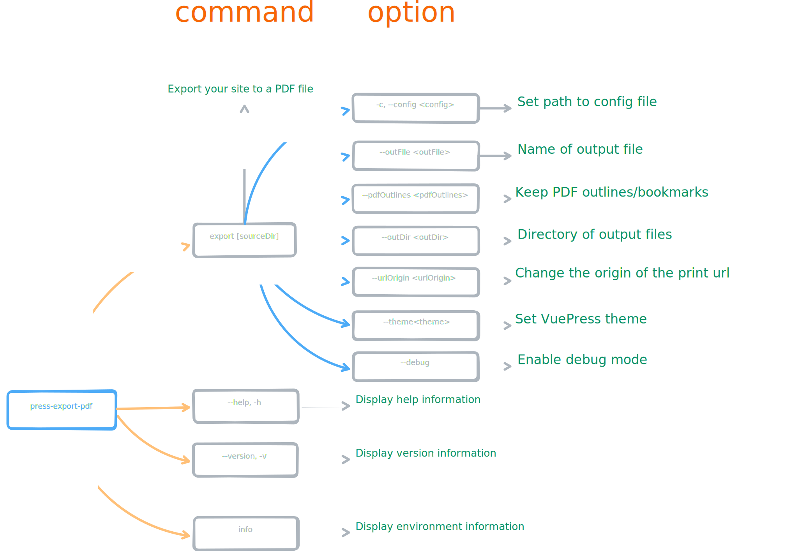

# @condorhero/vuepress-plugin-export-pdf

> If you are using `VuePress2.x`, please use [vuepress-plugin-export-pdf-v2](https://github.com/condorheroblog/vuepress-plugin-export-pdf/blob/main/packages/vuepress-plugin-export-pdf-v2/README.md)

`@condorhero/vuepress-plugin-export-pdf` is a VuePress plugin that allows you to export your sites to a PDF file with **outlines or bookmarks**.

<p align="center">
    <a href="https://www.npmjs.com/package/@condorhero/vuepress-plugin-export-pdf" target="__blank">
        
    </a>
    <a href="https://www.npmjs.com/package/@condorhero/vuepress-plugin-export-pdf" target="__blank">
        
    </a>
    <br />
</p>

> Inspired by [vuepress-plugin-export](https://github.com/ulivz/vuepress-plugin-export) and [vuepress-plugin-pdf-export](https://github.com/SnowdogApps/vuepress-plugin-pdf-export)

## Related

- [vitepress-export-pdf](https://github.com/condorheroblog/vitepress-export-pdf)
- [@condorhero/vuepress-plugin-export-pdf-v2](https://github.com/condorheroblog/vuepress-plugin-export-pdf/blob/main/packages/vuepress-plugin-export-pdf-v2/README.md)

## Installation

```sh
npm install @condorhero/vuepress-plugin-export-pdf -D
```
then add script to your `package.json`:

```json
{
	"scripts": {
		"export-pdf": "press-export-pdf export [path/to/your/docs]"
	}
}
```

Then run:

```sh
npm run export-pdf
```
## Usage

### press-export-pdf

The package provides the `press-export-pdf` command with the following command line options:



- `export [sourceDir]`: Export your site to a PDF file
  - `-c, --config <config>`: Set path to config file
  - `--outFile <outFile>`: Name of output file
  - `--pdfOutlines <pdfOutlines>`: Keep PDF outlines/bookmarks
  - `--urlOrigin <urlOrigin>`: Change the origin of the print url
  - `--outDir <outDir>`: Directory of output files
  - `--theme <theme>`: Set VuePress theme
  - `--debug`: Enable debug mode
- `info`: Display environment information
- `--help`: Display help information
- `--version`: Display version information

### Via VuePress plugin

`@condorhero/vuepress-plugin-export-pdf` exports a function called vuepressplugin, then use this function through VuePress plugin system.

for example:

```js
module.exports = {
	plugins: [
		require("./my-plugin.js"),
	],
};
```

`my-plugin.js`:

```js
const { vuePressPlugin } = require("@condorhero/vuepress-plugin-export-pdf");
module.exports = vuePressPlugin;
```

## Config options

You can create a new config file, we support the following files:

- `vuepress-pdf.config.ts`
- `vuepress-pdf.config.js`
- `vuepress-pdf.config.cjs`
- `vuepress-pdf.config.mjs`
- `.vuepress/vuepress-pdf.config.ts`
- `.vuepress/vuepress-pdf.config.js`
- `.vuepress/vuepress-pdf.config.cjs`
- `.vuepress/vuepress-pdf.config.mjs`

In addition, you can also customize the configuration file through `--config` or `-c`.

It is recommended to use TS(`.vuepress/vuepress-pdf.config.ts`) files, which are easy to manage and have **friendly code prompts**.

ex:

```ts
// .vuepress/vuepress-pdf.config.ts
import { defineUserConfig } from "@condorhero/vuepress-plugin-export-pdf";

export default defineUserConfig({
	theme: "@vuepress/theme-default",
});
```
if you want to use JS files, **you can leverage your IDE's intellisense with jsdoc type hints**:

```js
/**
 * @type {import('@condorhero/vuepress-plugin-export-pdf').UserConfig}
 */
const config = {
	// ...
};

export default config;
```

config options:

- `theme` - theme name (default `@vuepress/default`)
- `sorter` - function for changing pages order (default `undefined`)
- `outFile` - name of output file (default `vuepress-YYMMDD-HHmmss.pdf`)
- `outDir` - Directory of output files (default `package.json` file exists in directory)
- `routePatterns` - Specify the patterns of files you want to be exported. The patterns are relative to the source directory (default `["/**", "!/404.html"]`).Patterns to match Route path using [multimatch](https://github.com/sindresorhus/multimatch)
- `puppeteerLaunchOptions` - [Puppeteer launch options object](https://github.com/puppeteer/puppeteer/blob/main/docs/api/puppeteer.puppeteerlaunchoptions.md)
- `pdfOptions` - [Valid options to configure PDF generation via Page.pdf()](https://github.com/puppeteer/puppeteer/blob/main/docs/api/puppeteer.pdfoptions.md) (default `{ format: 'A4 }`)
- `pdfOutlines` - Keep PDF outlines/bookmarks(default `true`)
- `urlOrigin`: Change the origin of the print url([How do I change the URL point to the localhost](https://github.com/condorheroblog/vuepress-plugin-export-pdf/issues/5))
## PDF print style

By default, `A4` paper is used for printing, The size of A4 paper is (8.27in x 11.7in), One inch is equal to ninety-six pixels: `1 in = 96 pixel (X)` ,the inch unit of A4 is converted to (793.92px x 1123.2px).

The layout of VuePress itself is responsive, which should meet your needs. If you change the size of the printing paper or don't want some styles on the website to be input into PDF, you need to simply write some CSS styles.

It is recommended that you change it in the [global style](https://vuepress.vuejs.org/guide/directory-structure.html#default-page-routing) of VuePress(`docs/.vuepress/styles/index.styl`), use the `print` of `@media` to control CSS style.

for example:

```styl
@media print {
  .navbar,
  .sidebar,
  .sidebar-mask,
  .page-edit,
  .page-nav {
    display: none;
  }
}
```


## Examples

### Discard your outlines/bookmarks

`.vuepress/vuepress-pdf.config.ts` add `pdfOutlines`:

```ts
export default defineUserConfig({
	pdfOutlines: false,
});
```

### Don't export homepage

`.vuepress/vuepress-pdf.config.ts` add `routePatterns`:

```ts
export default defineUserConfig({
	routePatterns: ["!/"],
});
```

> Note: `!` at the beginning of a pattern will negate the match

## Contributing

1. Fork it!
2. Create your feature branch: git checkout -b my-new-feature
3. Commit your changes: git commit -am 'Add some feature'
4. Push to the branch: git push origin my-new-feature
5. Submit a pull request :D

## Report Bug

run `vuepress info` or `press-export-pdf info` Shows debugging information about the local environment.

## License

[MIT](https://github.com/condorheroblog/vuepress-plugin-export-pdf/blob/main/LICENSE)
