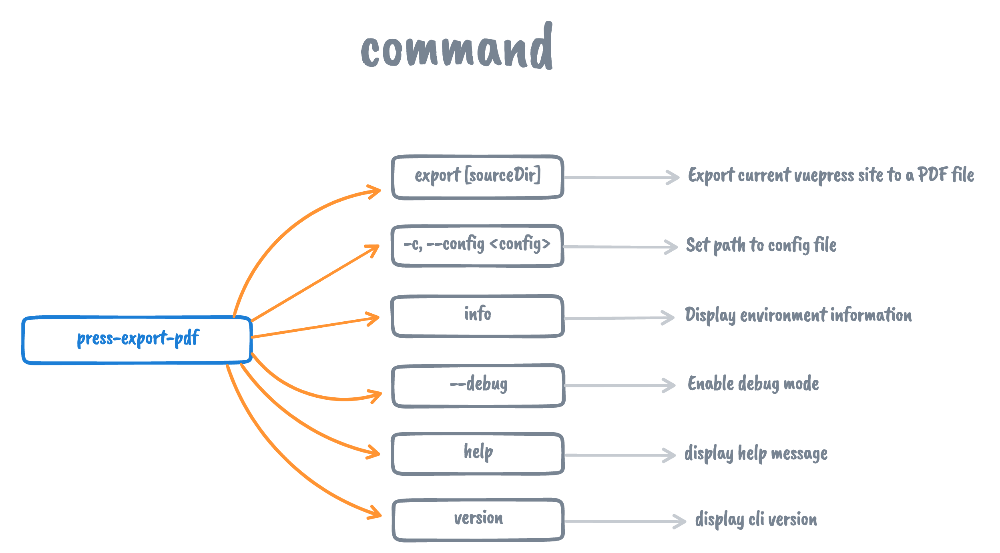

# @condorhero/vuepress-plugin-export-pdf

`@condorhero/vuepress-plugin-export-pdf` is a VuePress plugin that allows you to export your sites to a PDF file.

<p align="center">
    <a href="https://www.npmjs.com/package/@condorhero/vuepress-plugin-export-pdf" target="__blank">
        
    </a>
    <a href="https://www.npmjs.com/package/@condorhero/vuepress-plugin-export-pdf" target="__blank">
        
    </a>
    <a href="https://packagephobia.now.sh/result?p=@condorhero/vuepress-plugin-export-pdf" target="__blank">
        
    </a>
    <br />
</p>

> Inspired by [vuepress-plugin-export](https://github.com/ulivz/vuepress-plugin-export) and [vuepress-plugin-pdf-export](https://github.com/SnowdogApps/vuepress-plugin-pdf-export)

## Installation

```sh
npm install @condorhero/vuepress-plugin-export-pdf
```
then add script to your `package.json`:

```json
{
  "scripts": {
    "export-pdf": "press-plugin-export-pdf export [path/to/your/docs]"
  }
}
```

Then run:

```sh
npm run export-pdf
```
## Usage

There are four command lines included:



- `export [sourceDir]`: Export your site to a PDF file
- `-c, --config <config>`: Set path to config file
- `info`: Display environment information
- `version`: Display version information
- `help`: Display help information
- `--debug`: Enable debug mode

## Config options

- `theme` - theme name (default `@vuepress/default`)
- `sorter` - function for changing pages order (default `undefined`)
- `outputFileName` - name of output file (default `vuepress-YYMMDD-HHmmss.pdf`)
- `puppeteerLaunchOptions` - [Puppeteer launch options object](https://github.com/puppeteer/puppeteer/blob/v2.1.1/docs/api.md#puppeteerlaunchoptions) (default `{}`)
- `pageOptions` - [Puppeteer page formatting options object](https://github.com/puppeteer/puppeteer/blob/v2.1.1/docs/api.md#pagepdfoptions) (default `{format: 'A4'}`)

## PDF print style

By default, `A4` paper is used for printing, The size of A4 paper is (8.27in x 11.7in), One inch is equal to ninety-six pixels: `1 in = 96 pixel (X)` ,the inch unit of A4 is converted to (793.92px x 1123.2px).

The layout of VuePress itself is responsive, which should meet your needs. If you change the size of the printing paper or don't want some styles on the website to be input into PDF, you need to simply write some CSS styles.

It is recommended that you change it in the [global style](https://vuepress.vuejs.org/guide/directory-structure.html#default-page-routing) of VuePress(`docs/.vuepress/styles/index.styl`), use the `print` of `@media` to control CSS style.

for example:

```styl
@media print {
  .navbar,
  .sidebar,
  .sidebar-mask,
  .page-edit,
  .page-nav {
    display: none;
  }
}
```


## Contributing

1. Fork it!
2. Create your feature branch: git checkout -b my-new-feature
3. Commit your changes: git commit -am 'Add some feature'
4. Push to the branch: git push origin my-new-feature
5. Submit a pull request :D

## License

[MIT](https://github.com/condorheroblog/vuepress-plugin/blob/main/LICENSE)
